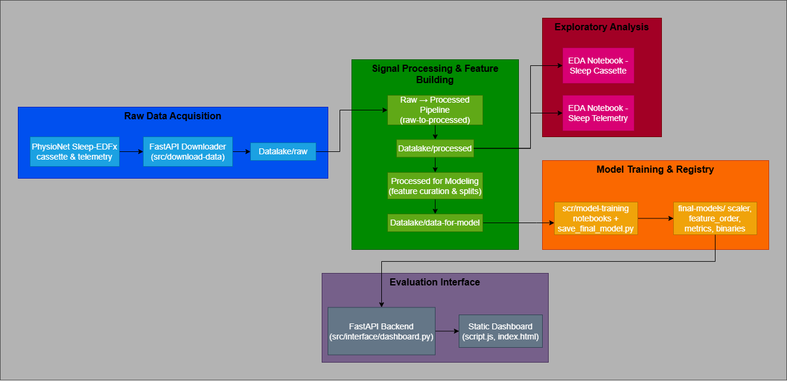

# Sleep Stages Classification

> End-to-end toolkit for ingesting Sleep-EDFx, crafting leakage-free features, benchmarking classical and deep models, and exploring results in a real-time dashboard.

---

## Architheture



---

## Table of Contents
- [Sleep Stages Classification](#sleep-stages-classification)
  - [Architheture](#architheture)
  - [Table of Contents](#table-of-contents)
  - [Overview](#overview)
  - [Pipeline Architecture](#pipeline-architecture)
  - [Quick Start](#quick-start)
    - [1. Prepare the environment](#1-prepare-the-environment)
    - [2. Download raw Sleep-EDFx files](#2-download-raw-sleep-edfx-files)
    - [3. Build processed feature layers](#3-build-processed-feature-layers)
    - [4. Train and export models](#4-train-and-export-models)
    - [5. Run the dashboard](#5-run-the-dashboard)
  - [Interactive Dashboard](#interactive-dashboard)
  - [Model Leaderboard](#model-leaderboard)
  - [Documentation Map](#documentation-map)
  - [Repository Layout](#repository-layout)
  - [Dependencies \& Environments](#dependencies--environments)
  - [Design Decisions](#design-decisions)
  - [Troubleshooting](#troubleshooting)
  - [License](#license)

---

## Overview

Sleep Stages Classification wraps the complete experimentation loop around Sleep-EDFx polysomnography data sourced from the [PhysioNet Sleep-EDFx 1.0.0 collection](https://www.physionet.org/content/sleep-edfx/1.0.0/#files-panel). The project is opinionated around:

- resilient acquisition of raw EDF + hypnogram files with hashing and resume support,
- high-throughput feature extraction and subject-aware splitting that avoids leakage,
- a catalogue of classical machine learning baselines and a residual MLP tuned for imbalanced stages, and
- a FastAPI dashboard that surfaces metrics, confusion matrices, full-test-set simulations, and per-stage diagnostics.

The repository is ready for research iterations, production-style model refreshes, and exploratory science.

## Pipeline Architecture

```
[ download-data ] -> [ raw-to-processed ] -> [ processed-for-data-for-model ] -> [ model-training ] -> [ interface ]
```

1. **Acquisition (`src/download-data`)** - FastAPI service that plans missing files, retries transient HTTP failures, and keeps hashes of processed artefacts. See [Sleep-EDF Download Service](src/download-data/README.md).
2. **Signal alignment (`src/data-processing/raw-to-processed`)** - Converts PSG/hypnogram pairs into epoch-level feature tables using multiprocessing, Rich progress bars, and deterministic hashing. Details in [raw-to-processed guide](src/data-processing/raw-to-processed/readme.md).
3. **Feature curation (`src/data-processing/processed-for-data-for-model`)** - Uses Polars and pandas to enrich the processed parquets with rolling statistics, demographic bins, and subject-level splits ready for modelling.
4. **Model training (`src/model-training`)** - Notebooks and scripts that train Logistic Regression, Naive Bayes, Random Forest, LightGBM, XGBoost, and the Residual MLP, saving artefacts into `final-models/`.
5. **Evaluation interface (`src/interface`)** - FastAPI + vanilla JS dashboard that streams classification reports, confusion matrices, probability exploration, and a stop-anytime combined simulation.

Each stage can be executed in isolation or end-to-end depending on the experimentation cycle.

## Quick Start

Follow the sequence below from the project root.

### 1. Prepare the environment

```bash
python -m venv .venv
source .venv/bin/activate
pip install --upgrade pip
pip install -r requirements.txt
```

Optional: install module-specific requirements from the respective folders if you plan to run notebooks or pipelines independently.

### 2. Download raw Sleep-EDFx files

```bash
pip install -r src/download-data/requirements.txt
uvicorn src.download-data.main:app --host 0.0.0.0 --port 8000 --reload
```

Trigger jobs from another shell (synchronous example):

```bash
curl "http://localhost:8000/download?subset=cassette&sync=true"
curl "http://localhost:8000/download?subset=telemetry&sync=true"
```

Files land under `datalake/raw/sleep-cassette|sleep-telemetry`.

### 3. Build processed feature layers

1. Transform EDF pairs into processed parquets:

   ```bash
   python src/data-processing/raw-to-processed/main.py \
     --root datalake/raw \
     --out-sc datalake/processed \
     --out-st datalake/processed
   ```

2. Generate modelling datasets with rolling context and stratified subject splits:

   ```bash
   python src/data-processing/processed-for-data-for-model/processor.py
   ```

Outputs populate `datalake/processed/` and `datalake/data-for-model/`.

### 4. Train and export models

```bash
python -m src.model_training.save_final_models --force
```

Artefacts (`*.pkl`, `*.json`, `*.pt`, scaler, feature order, stage mapping, metrics) are written to `final-models/`.

### 5. Run the dashboard

```bash
uvicorn src.interface.dashboard:app --reload
```

Open <http://127.0.0.1:8000>. The simulation replays every epoch of the held-out test split and can be paused or resumed via the control buttons.

## Interactive Dashboard

The dashboard concentrates model comparison and qualitative inspection:

- **Dataset selector** exposes mirrored views for Sleep Cassette and Sleep Telemetry, updating every metric and simulation in lockstep.
- **KPI cards & confusion matrix** updated per-model via dropdown selectors.
- **Model performance overview** with aligned metric tables and bar charts.
- **Classification report explorer** for per-stage precision/recall/F1/support across models.
- **Probability analytics** including stacked histograms and one-vs-rest ROC curves.
- **Epoch simulation** that streams subject/night/epoch context, highlights agreement across models, covers the entire test dataset, and now includes explicit Play/Stop controls to interrupt long replays.

Endpoints:
- `GET /api/models` - metadata, metrics, confusion matrices, and classification reports.
- `GET /api/simulation` - precomputed frames for the full-test-set playback.
- `GET /api/probabilities?model=<id>` - probability tensors for ROC/Histogram tooling.

## Model Leaderboard

Latest evaluation on the held-out test split (`final-models/metrics.json`):

| Model                  | Accuracy | Balanced Acc. | Macro F1 | Notes                                                        |
|------------------------|---------:|--------------:|---------:|--------------------------------------------------------------|
| Logistic Regression    | 0.723    | 0.717         | 0.667    | Strong multinomial baseline with saga solver                 |
| Naive Bayes            | 0.649    | 0.639         | 0.581    | Fast, probability-calibrated generative approach             |
| Random Forest          | 0.778    | 0.692         | 0.700    | Balanced subsampling ensemble                                |
| LightGBM               | 0.767    | 0.728         | 0.708    | Gradient boosting with early stopping                        |
| XGBoost                | 0.794    | 0.706         | 0.716    | Histogram booster with the best accuracy                     |
| Residual MLP           | 0.703    | 0.715         | 0.656    | Skip-connected network with focal loss favouring N3 and REM  |

Per-stage metrics remain available through the dashboard classification report selector.

## Documentation Map

- [guide/fundamentals.md](guide/fundamentals.md) - domain notes, hypotheses, and modelling principles.
- [guide/data-guide.md](guide/data-guide.md) - dataset dictionaries, feature descriptions, and cleaning tips.
- [src/download-data/README.md](src/download-data/README.md) - Sleep-EDFx downloader API.
- [src/data-processing/raw-to-processed/readme.md](src/data-processing/raw-to-processed/readme.md) - raw-to-tabular pipeline with hashing and progress insights.
- Model-specific training notes:
  - [LightGBM](src/model-training/lightgbm-model/README.md)
  - [XGBoost](src/model-training/xgboost-model/README.md)
  - [Random Forest](src/model-training/random-forest-model/README.md)
  - [Logistic Regression](src/model-training/logistic-regression-model/README.md)
  - [Naive Bayes](src/model-training/naive-bayes-model/README.md)
  - [Residual MLP](src/model-training/mlp-model/README.md)
- Dashboard source: `src/interface/` (FastAPI backend + static assets).

## Repository Layout

```
├── datalake/                     # Raw, processed, and modelling datasets (generated locally)
├── final-models/                 # Persisted models, scaler, metrics (generated)
├── guide/                        # Auxiliary documentation (fundamentals, data dictionary)
├── requirements.txt              # Core runtime/dashboard dependencies
├── src/
│   ├── download-data/            # Sleep-EDFx downloader service
│   ├── data-processing/
│   │   ├── raw-to-processed/     # EDF -> processed parquet pipeline
│   │   └── processed-for-data-for-model/  # Feature curation & splits
│   ├── data-analysis/            # Notebook-based EDA
│   ├── model-training/           # Training notebooks and artefact exporter
│   ├── interface/                # FastAPI dashboard (backend + static frontend)
│   └── logger/                   # Shared logging utilities
└── README.md
```

## Dependencies & Environments

- `requirements.txt` now lists the primary runtime stack used by the dashboard and evaluation utilities (FastAPI, Uvicorn, pandas, numpy, scikit-learn, PyTorch, LightGBM, XGBoost, fastparquet, joblib, etc.).
- Each module exposes its own `requirements.txt` under subfolders (downloader, data-processing pipelines, data-analysis notebooks, model-training packages). Install them selectively when running those components in isolation.
- All requirements omit version pins by default so you can align them with your environment; pin versions in derived projects or deployment manifests as needed.

## Design Decisions

- **Subject-level, quota-aware splits** eliminate temporal leakage and maintain demographic balance between train/val/test.
- **Rolling temporal context** injects neighbourhood statistics without peeking into future epochs, improving transition modelling.
- **Artefact registry** (`final-models/`) keeps scaler, feature order, stage mapping, metrics, and model binaries side-by-side for reproducibility.
- **Dashboard-first evaluation** encourages qualitative inspection across models, stages, and epochs before formal reporting.
- **Interruptible simulation** acknowledges the full-test-sequence playback by providing explicit controls for long sessions.

## Troubleshooting

| Issue | Fix |
|-------|-----|
| Downloader appears idle | Increase `workers` and `batch_size`, or disable hash filtering with `ignore_hash=true` for a full rescan. |
| Out-of-memory during LightGBM/XGBoost | Lower `n_estimators`, shrink `num_leaves`/`max_depth`, or run on a machine with more RAM. |
| Inconsistent scikit-learn pickle warning | Re-run `save_final_models.py` using the currently installed scikit-learn to regenerate artefacts. |
| Dashboard shows "Simulation data unavailable" | Rebuild models (`python -m src.model_training.save_final_models --force`) and restart the interface so the cached frames are refreshed. |
| Simulation too long | Use the **Stop** button in the dashboard controls; playback state resets and can be resumed later. |
| Slow MLP training | Enable CUDA, reduce `epochs`, or decrease `hidden_dim` in the notebook configuration. |

## License

Distributed under the MIT License. See [LICENSE](LICENSE) for details.

---

Contributions and experimentation ideas (new features, models, metrics, or visualisations) are very welcome.
